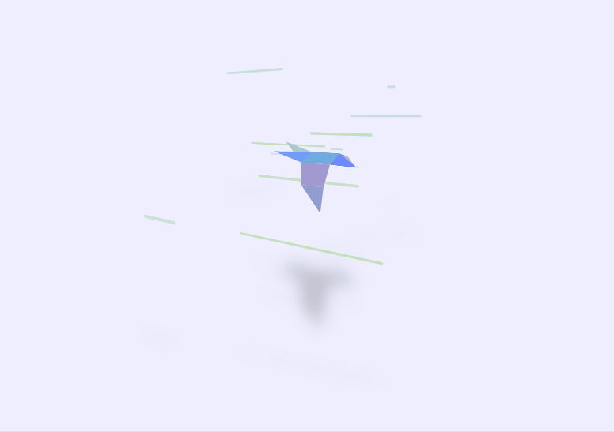
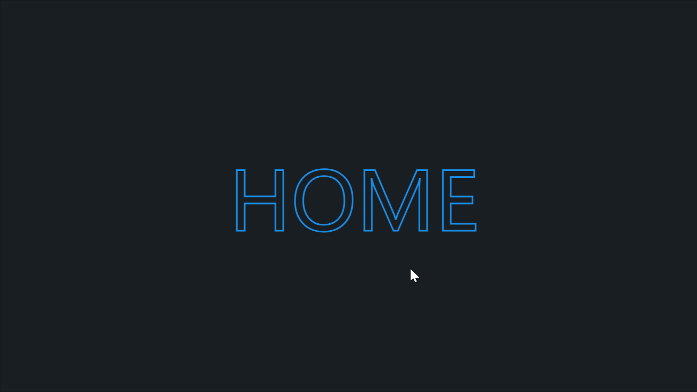

# zc-demos
仓库主要存储一些日常编写的demo

## games
> 存放使用使用JS编写的游戏

## display
> 存放一些比较好的实现效果
- [x] rockets launch: (缅怀两弹元勋钱老)火箭发射
- [x] 自由飞翔的小鸟
  
### font(文字效果)
- [x] 文字粒子效果
- [x] `background-clip:text` 实现 `hover` 文字填充效果

- [x] 跃动的文字

### border
- [x] 随机不规则圆角实现

### animation
- [x] animation-delay 负值实现 loading 效果

### 酷炫的CSS
- [x] 绘制口红
- [x] 粒子的万有引力与斥力