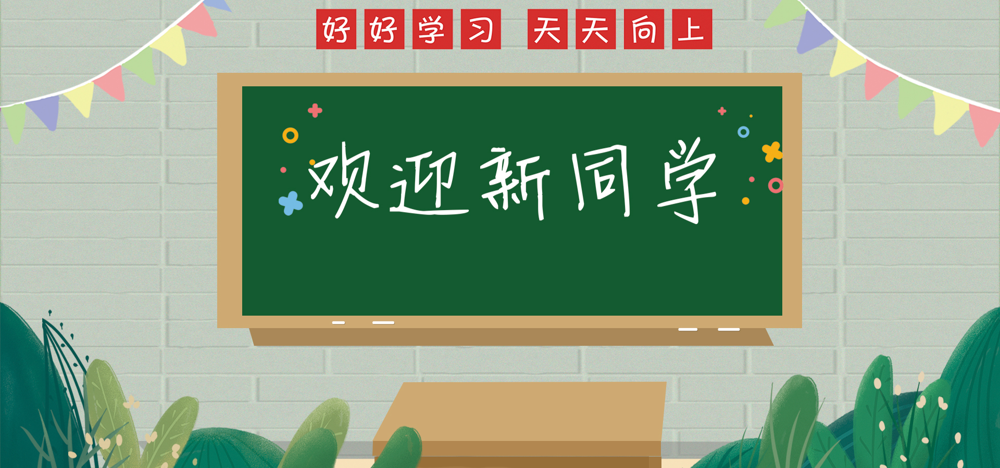
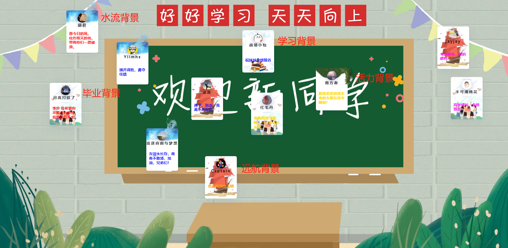
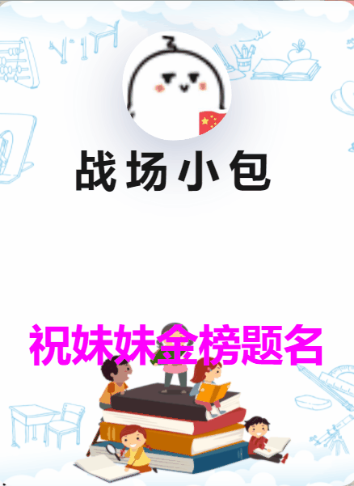

## 前言

夏日是炎热的酷暑，也是激昂的岁月，再有一周，青春的风暴将叩响大学之门，开启异彩纷呈的人生旅途。高考，或许你已经经历过，或许你正要经历，对这批即将登上考场的青春风暴，你是否**有些祝福要讲，有些经验要谈，有些过往要忆，有些美好要述**，欢迎在评论中表述你的想法和祝福，小包会及时的将你的祝福更新到墙上，同时小包也会将此网页转发给即将高考的伙伴们，也欢迎大家转发。

## 想法

妹妹就是今年高考大军中的一员，高考越来越近，压力也日渐增大，小包和家人也承受着同样的紧张。高考并不简单，这是一场勇气与心态的较量，作为加油助威团，小包就实现个祝福墙吧。

祝福墙中小包加入了很多小心思，下面先跟大家分享一下。

**Case1：背景**



背景小包选用"一语双关"的方式，这既是高中的入学仪式，希望学子们能永远的记住高中的青春岁月；另一方面小包希望这也是大学的入学仪式，希望学子们都如愿以偿。

**Case2：七彩祝福语**

祝福语的颜色小包想了很久，最终选择了 🌈 的颜色(其中几个颜色稍微变动了一点)，希望年轻的栋梁们都能见识风雨之后的彩虹，也能拥有七彩的大学生活。

**Case3：祝福卡片的背景**



精挑细选，小包最后选用了五种背景:

- 水流背景: "上善若水，水善利万物而不争"，小包希望每位学子考试中，都平静如水，心态为王。
- 毕业背景: 夏日的毕业如夏花一般绚烂，夏日的繁星点点未尝不是每个学子的过往精彩，这个夏天希望可以无怨无悔、快乐无忧的毕业。
- 远航背景: 每个人都有一艘船，你会选择远航吗？你是掌舵人，你决定！
- 学习背景: 这个小包没想到好的表达，其实意思是很简单的，做书的主人，开心快乐的学习，顺利完成高考。
- 活力背景: 绿色，意味着生机，意味着活力，新的学子是国家未来发展的活水，希望能给疫情的岁月中加入无尽的活力。

**Case4：祝福者头像**

每个祝福者的头像小包给加入了生动的动效效果，希望你们可以感受到祝福的真挚和善良的心灵。

## 实现

下面小包来讲一下项目中的亮点和总体实现。

### 总体设计

祝福墙由多个祝福卡片组成，当打开祝福墙后，根据用户祝福随机生成祝福卡片及其位置。祝福卡片有五种，小包预先写好了五种卡片对应的 CSS 样式。

**Step1: 定义卡片模板生成函数**

```js
// 项目虽然有五种模板，单核心只有三种
const hopeTemplate = function (option) {
  switch (option.id) {
    case 1:
      return `<div class="card-wrap">
      <div class="card">
        <div class="card-content">
          <div class="avatar">
            
          </div>
          <h4>${option.name}</h4>
          <div class="hope">${option.hope}</div>
          <div class="img-wrap img-2">
            
          </div>
          <div class="img-wrap img-3">
            
          </div>
        </div>
      </div>
    </div>`;
    case 2:
      return `<div class="card-wrap">
        <div class="card">
          <div class="card-content">
            <div class="avatar">
              
            </div>
            <h4 class="username">${option.name}</h4>
            <div class="hope">${option.hope}</div>
            <div class="img-wrap img-2">
              
            </div>
  
            <div class="img-wrap img-5">
              
            </div>
          </div>
        </div>
      </div>`;
    default:
      return `<div class="card-wrap">
        <div class="card ${option.class}">
          <div class="card-content">
            <div class="avatar">
              
            </div>
            <h4 class="username">${option.name}</h4>
            <div class="hope">${option.hope}</div>
          </div>
        </div>
      </div>`;
  }
};
```

**Step2：根据祝福语插入模板**

```js
//创建祝福页
let createItem = function (hopeItem) {
  // 利用随机数选择模板
  const id = randomNtoM(1, 5);
  const template = hopeTemplate({ id, ...hopeItem, class: background[id] });
  // drag 函数定义了卡片的拖拽
  $(template).appendTo(container).drag();
};
```

**Step3: 设置卡片的位置及颜色**

```js
const $this = $(this);
const parent = $this.parent();
const hopeColor = randomNtoM(0, 6);

// 设置用户名颜色和祝福语颜色
$(this).find(".hope").css({ color: colors[hopeColor] });
$(this).find("h4").css({ color: "#000" });

const pw = parent.width();
const ph = parent.height();
// 获取卡片位置
const thisWidth =
  $this.width() +
  parseInt($this.css("padding-left"), 10) +
  parseInt($this.css("padding-right"), 10);
const thisHeight =
  $this.height() +
  parseInt($this.css("padding-top"), 10) +
  parseInt($this.css("padding-bottom"), 10);
let x, y, positionX, positionY;
let isDown = false;
// 设置卡片的位置
// 避免卡片显示出界
const randY = parseInt(Math.random() * (ph - thisHeight), 10);
const randX = parseInt(Math.random() * (pw - thisWidth), 10);

// 设置位置
$this.css({
  top: randY,
  left: randX,
});
```

### 动态头像

让头像动起来其实并不难，首先看一下最终的实现效果:



咱们来眨眼补帧一下，可以发现每帧图像的图像都有所差异，但仔细看其实就是四周椭圆角的变化。

我们可以使用 border-radius 来设置圆角，但如果如下设置 border-radius: 30%/70%，则可以实现椭圆角效果。(图源: [CSS 实现随机不规则圆角头像](https://juejin.cn/post/7034396555738251301))


基于 animation 设置多个状态的 border-radius ，就可以实现动态的椭圆变化，实现动态头像。

```css
@keyframes border-transform {
  0%,
  100% {
    border-radius: 63% 37% 54% 46% / 55% 48% 52% 45%;
  }
  14% {
    border-radius: 40% 60% 54% 46% / 49% 60% 40% 51%;
  }
  28% {
    border-radius: 54% 46% 38% 62% / 49% 70% 30% 51%;
  }
  42% {
    border-radius: 61% 39% 55% 45% / 61% 38% 62% 39%;
  }
  56% {
    border-radius: 61% 39% 67% 33% / 70% 50% 50% 30%;
  }
  70% {
    border-radius: 50% 50% 34% 66% / 56% 68% 32% 44%;
  }
  84% {
    border-radius: 46% 54% 50% 50% / 35% 61% 39% 65%;
  }
}

.card-content .avatar img {
  position: absolute;
  z-index: 2;
  width: 36px;
  height: 36px;
  display: block;
  left: 50%;
  transform: translate(-50%, -50%);
  box-shadow: 0 6px 20px 0 rgba(16, 39, 112, 0.3);
  animation: border-transform 6s linear infinite;
}
```

### 拖拽效果

拖拽效果是老生长谈了，通常需要监听三个事件: mousedown、mouseup、mousemove。

**Event1：mousedown 事件**:

mousedown 事件主要有下面几件事要做:

- 记录鼠标的位置
- 记录卡片的位置
- 增大当前卡片的 zIndex ，避免它被遮住
- 加锁

```js
mousedown(function (e) {
  // 设置当前卡片zIndex最大
  parent.children().css({
    zIndex: "0",
  });
  $this.css({
    zIndex: "1",
  });
  isDown = true;
  x = e.pageX;
  y = e.pageY;
  positionX = $this.position().left;
  positionY = $this.position().top;
  return false;
});
```

**Event2：mousemove 事件**:

mousemove 是拖拽部分的核心，它需要处理:

- 根据新鼠标位置计算卡片新位置，修改卡片的 left 与 top 值
- 判断临界条件，避免卡片移出页面

```js
mousemove(function (e) {
  let xPage = e.pageX;
  let moveX = positionX + xPage - x;

  let yPage = e.pageY;
  let moveY = positionY + yPage - y;

  if (isDown == true) {
    $this.css({
      left: moveX,
      top: moveY,
    });
  } else {
    return;
  }
  if (moveX < 0) {
    $this.css({
      left: "0",
    });
  }
  if (moveX > pw - thisWidth) {
    $this.css({
      left: pw - thisWidth,
    });
  }
  if (moveY < 0) {
    $this.css({
      top: "0",
    });
  }
  if (moveY > ph - thisHeight) {
    $this.css({
      top: ph - thisHeight,
    });
  }
});
```

**Event3：mouseup 事件**:

mouseup 事件就相对简单多了，解锁即可。

```js
mouseup(function (e) {
  isDown = false;
});
```
